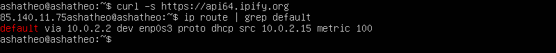
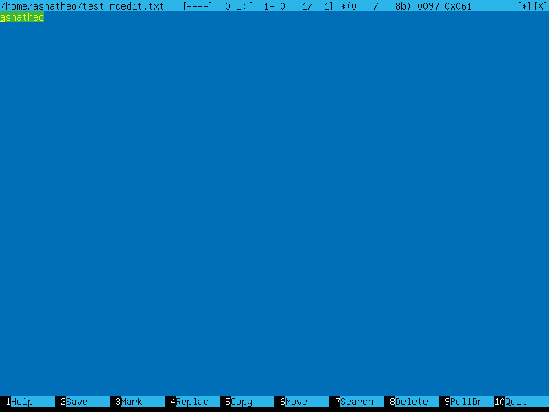
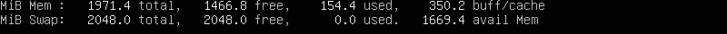
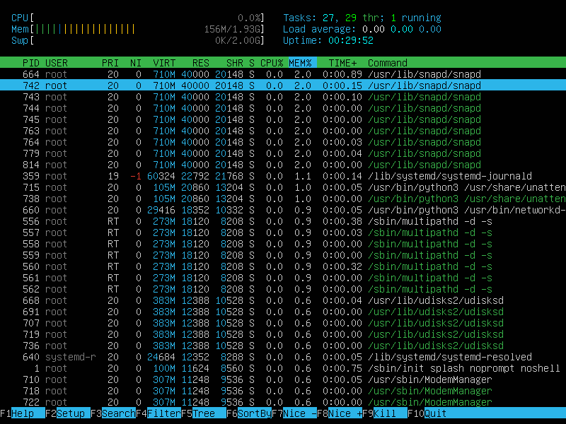
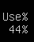
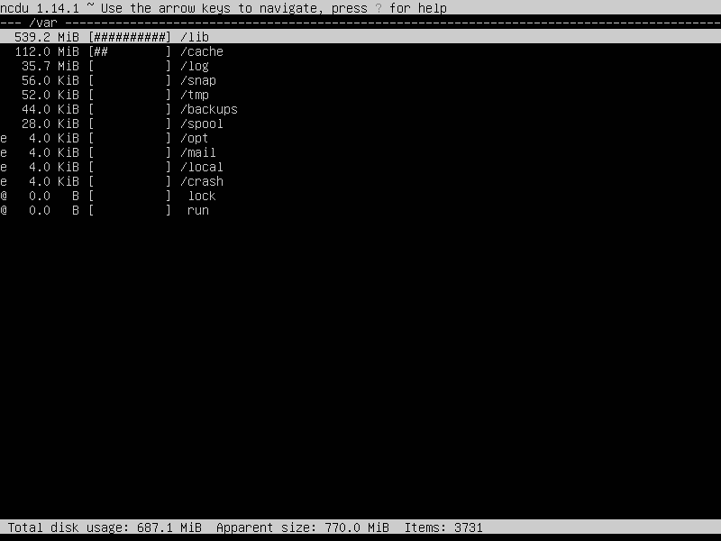
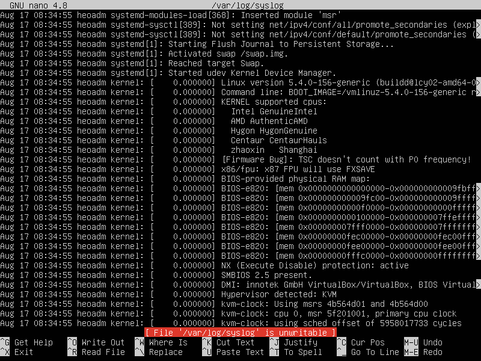
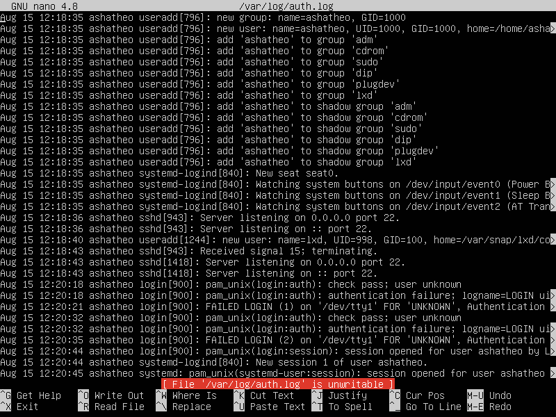
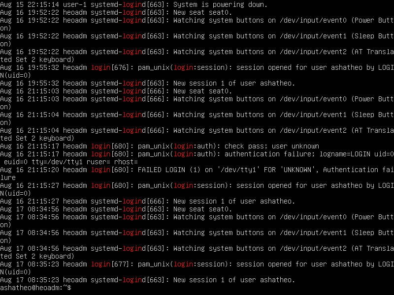

# UNIX/Linux operating systems (Basic)
Linux system installation and updates. Administration basics.
```
888                           d8888          888               888    888                        
888                          d88888          888               888    888                        
888                         d88P888          888               888    888                        
88888b.  888  888          d88P 888 .d8888b  88888b.   8888b.  888888 88888b.   .d88b.   .d88b.  
888 "88b 888  888         d88P  888 88K      888 "88b     "88b 888    888 "88b d8P  Y8b d88""88b 
888  888 888  888        d88P   888 "Y8888b. 888  888 .d888888 888    888  888 88888888 888  888 
888 d88P Y88b 888       d8888888888      X88 888  888 888  888 Y88b.  888  888 Y8b.     Y88..88P 
88888P"   "Y88888      d88P     888  88888P' 888  888 "Y888888  "Y888 888  888  "Y8888   "Y88P"  
              888                                                                                
         Y8b d88P                                                                                
          "Y88P"                                                                                 
```

## Содержание

1. [Установка ОС](#part-1-установка-ос)  
2. [Создание пользователя](#part-2-создание-пользователя)  
3. [Настройка сети ОС](#part-3-настройка-сети-ос)   
4. [Обновление ОС](#part-4-обновление-ос)  
5. [Использование команды  sudo](#part-5-использование-команды-sudo)  
6. [Установка и настройка службы времени](#part-6-установка-и-настройка-службы-времени)  
7. [Установка и использование текстовых редакторов](#part-7-установка-и-использование-текстовых-редакторов)  
8. [Установка и базовая настройка сервиса SSHD](#part-8-установка-и-базовая-настройка-сервиса-sshd)   
9. [Установка и использование утилит top, htop](#part-9-установка-и-использование-утилит-top-htop)   
10. [Использование утилиты fdisk](#part-10-использование-утилиты-fdisk)   
11. [Использование утилиты df](#part-11-использование-утилиты-df)    
12. [Использование утилиты du](#part-12-использование-утилиты-du)    
13. [Установка и использование утилиты ncdu](#part-13-установка-и-использование-утилиты-ncdu)    
14. [Работа с системными журналами](#part-14-работа-с-системными-журналами)     
15. [Использование планировщика заданий CRON](#part-15-использование-планировщика-заданий-cron)

## Part 1. Установка ОС

**== Задание ==**

##### Установить **Ubuntu 20.04 Server LTS** без графического интерфейса. (Используем программу для виртуализации - VirtualBox)

**== Выполнение ==**

#### 1. Скачиваем VirtualBox с Оффициального сайта https://www.virtualbox.org/
#### 2. Скачиваем ISO образ Ubuntu 20.04 Server LTS** без графического интерфейса
#### 3. Устанавливаем виртуальный образ нашей системы
#### 4. Используя команду `cat /etc/issue` узнаем версию установленной Ubuntu

<br>*Версия Ubuntu*<br>

## Part 2. Создание пользователя

**== Задание ==**

##### Создать пользователя, отличного от пользователя, который создавался при установке. Пользователь должен быть добавлен в группу `adm`.

**== Выполнение ==**

#### 1. Выполняем команду `sudo adduser heoadm` для создания нового пользователя с именем heoadm

<br>*-m создает домашний каталог для нового пользователя.
-G adm добавляет пользователя в группу "adm".*<br>

#### 2. Выполняем команду `sudo passwd heoadm` для создания пароля пользователя с именем heoadm

<br>*Создаем пароль для heoadm (он ведь администратор, как без пароля)*<br>

#### 3. Новый пользователь должен быть в выводе команды `cat /etc/passwd`

<br>*Вывод консоли после команды с нашим пользователем*<br>

## Part 3. Настройка сети ОС

Cетевые интерфейсы и DHCP.

**== Задание  ==**

##### Задать название машины вида user-1  

**== Выполнение ==**

#### 1. Выполняем команду `sudo hostnamectl set-hostname user-1` для смены названия машины на user-1
#### 2. Чтобы удостоверится в смене названия машины выполняем команду `cat /etc/hostname`

<br>*название нашей машины изменилось на user-1*<br>

**== Задание ==**

##### Установить временную зону, соответствующую вашему текущему местоположению.  

**== Выполнение ==**

#### 1. Выполняем команду `sudo timedatectl set-timezone Asia/Yekaterinburg`

#### 2. Проверяем результат, выполнив `timedatectl`

<br>*Смена часового пояса на местное время Сургута*<br>

**== Задание ==**

##### Вывести названия сетевых интерфейсов с помощью консольной команды.
- В отчёте дать объяснение наличию интерфейса lo.  

**== Выполнение ==**

#### 1. **lo (loopback device)** – виртуальный интерфейс, присутствующий по умолчанию в любом Linux. Он используется для отладки сетевых программ и запуска серверных приложений на локальной машине. С этим интерфейсом всегда связан адрес 127.0.0.1. У него есть dns-имя – localhost. Посмотреть привязку можно в файле /etc/hosts.

#### 2. Выполняем команду `ls /sys/class/net` для отображения сетевых интерфейсов

<br>*отображение сетевого интерфейса*<br>

**== Задание ==**

##### Используя консольную команду получить ip адрес устройства, на котором вы работаете, от DHCP сервера. 
- В отчёте дать расшифровку DHCP.  

**== Выполнение ==**

* **DHCP** — протокол прикладного уровня модели TCP/IP, служит для назначения IP-адреса клиенту. Это следует из его названия — Dynamic Host Configuration Protocol. IP-адрес можно назначать вручную каждому клиенту, то есть компьютеру в локальной сети. Но в больших сетях это очень трудозатратно, к тому же, чем больше локальная сеть, тем выше возрастает вероятность ошибки при настройке. Поэтому для автоматизации назначения IP был создан протокол DHCP.

* Выполняем команду `ip r` для получения ip-адреса от DHCP сервера

<br>*наш IP*<br>

**== Задание ==**

##### Определить и вывести на экран внешний ip-адрес шлюза (ip) и внутренний IP-адрес шлюза, он же ip-адрес по умолчанию (gw). 

**== Выполнение ==**

#### 1. Выполняем команду `curl -s https://api64.ipify.org` для запроса нашего внешнего ip адреса через внешние веб-сервисы  , и `ip route | grep default` для вывода внутреннего

<br>*внешний и внутренний ip aдреса*<br>

**== Задание ==**

##### Задать статичные (заданные вручную, а не полученные от DHCP сервера) настройки ip, gw, dns (использовать публичный DNS серверы, например 1.1.1.1 или 8.8.8.8).  

**== Выполнение ==**

#### 1. Меняем права доступа к файлу для дальнейшего его редактирования `sudo chmod 777 /etc/netplan/00-installer-config.yaml`

#### 2. Редактируем файл под нужные настройки используя любой текстовый редактор `nano /etc/netplan/00-installer-config.yaml` 

<br>*Задаем адреса и выходим из Nano*<br>

#### 3. Сохраняем изменения командой `sudo netplan apply`

**== Задание ==**

##### Перезагрузить виртуальную машину. Убедиться, что статичные сетевые настройки (ip, gw, dns) соответствуют заданным в предыдущем пункте.  
- Успешно пропинговать удаленные хосты 1.1.1.1 и ya.ru и вставить в отчёт скрин с выводом команды. В выводе команды должна быть фраза "0% packet loss".

**== Выполнение ==**

#### 1. Перезапускаем машину командой `reboot`
#### 2. Пингуем командой `ping 1.1.1.1 ` удаленный хост 1.1.1.1
#### 3. Пингуем командой `ping ya.ru ` удаленный хост 1.1.1.1

<br>*0% packet loss*<br>

## Part 4. Обновление ОС

**== Задание ==**

##### Обновить системные пакеты до последней на момент выполнения задания версии.  

- После обновления системных пакетов, если ввести команду обновления повторно, должно появится сообщение, что обновления отсутствуют.
- Вставить скриншот с этим сообщением в отчёт.

**== Выполнение ==**

#### 1. Выполняем команду `sudo apt update` для получения обновления доступных пакетов

#### 2. Обновляем системные пакеты до последней версии командой `sudo apt full-upgrade`

#### 3. Запускаем команду обновления ещё раз

<br>*отчет что обновлений не требуется*<br>

## Part 5. Использование команды **sudo**

**== Задание ==**

##### Разрешить пользователю, созданному в [Part 2](#part-2-создание-пользователя), выполнять команду sudo.

- В отчёте объяснить *истинное* назначение команды sudo (про то, что это слово - "волшебное", писать не стоит).  
- Поменять hostname ОС от имени пользователя, созданного в пункте [Part 2](#part-2-создание-пользователя) (используя sudo).
- Вставить скрин с изменённым hostname в отчёт.

**== Выполнение ==**

 Sudo (su «do») позволяет системному администратору делегировать полномочия, чтобы дать определенным пользователям (или группам пользователей) возможность запускать некоторые (или все) команды от имени пользователя root или другого пользователя, обеспечивая контрольный журнал команд и их аргументов.

#### 1. Командой `sudo usermod -a -G sudo heoadm` разрешаем пользователю использовать sudo

#### 2. Командой `su - heoadm` меняем пользователя

#### 3. Меняем hostname под другим пользователем `sudo hostnamectl set-hostname heoadm` 

#### 4. `cat /etc/hostname` смотрим результат

<br>*измененный hostname от лица heoadm*<br>

## Part 6. Установка и настройка службы времени

**== Задание ==**

##### Настроить службу автоматической синхронизации времени.  

- Вывести время часового пояса, в котором вы сейчас находитесь.
- Вывод следующей команды должен содержать `NTPSynchronized=yes`: \
  `timedatectl show`
- Вставить скрины с корректным временем и выводом команды в отчёт.

**== Выполнение ==**

#### 1. Выводим на экран текущее время часового пояса в котором мы находимся командой `timedatectl show` 
#### 2. Чтобы включить автоматическую синхронизацию времени, нужно ввести команду `sudo timedatectl set-ntp on`
#### 3. Еще раз выводим на экран время уже с включенной синхронизацией и убеждаемся, что она включилась

<br>*NTPSynchronized=yes*<br>

## Part 7. Установка и использование текстовых редакторов 

**== Задание ==**

##### Установить текстовые редакторы **VIM** (+ любые два по желанию **NANO**, **MCEDIT**, **JOE** и т.д.)  
##### Используя каждый из трех выбранных редакторов, создайте файл *test_X.txt*, где X -- название редактора, в котором создан файл. Напишите в нём свой никнейм, закройте файл с сохранением изменений.  
- В отчёт вставьте скриншоты:
  - Из каждого редактора с содержимым файла перед закрытием.
- В отчёте укажите, что сделали для выхода с сохранением изменений.

#### 1. Используя команду `sudo apt install mcedit` устанавливаем текстовый редактор mcedit
#### 2. Используя команду `sudo apt install nano` устанавливаем текстовый редактор nano
#### 3. Используя команду `sudo apt install vim` устанавливаем текстовый редактор vim
#### 4. Создаем файл с помощью команды `vim test_vim.txt` Нажимаем "i" для перехода в режим редактирования, пишем ник: "ashatheo"

<br>*Для выхода с сохранением нажимем `Esc` вводим команду `:wq` и нажимаем `Enter`*<br>

#### 5. Создаем файл с помощью команды `nano test_nano.txt` пишем ник: "ashatheo" сохраняем изменения

<br>*Для выхода нажимаем комбинацию `ctrl+x` для сохранения вводим `Y` и нажимаем `Enter`*<br>

#### 6. Cоздаем файл с помощью команды `mcedit test_mcedit.txt` пишем ник: "ashatheo" сохраняем изменения

<br>*Для выхода с сохранением нажимаем `Esc`, а затем выбрать в диалоговом окне `YES`*<br>

**== Задание ==**

##### Используя каждый из трех выбранных редакторов, откройте файл на редактирование, отредактируйте файл, заменив никнейм на строку "21 School 21", закройте файл без сохранения изменений.
- В отчёт вставьте скриншоты:
    - Из каждого редактора с содержимым файла после редактирования.
- В отчёте укажите, что сделали для выхода без сохранения изменений.

**== Выполнение ==**

#### 1. Открываем файл с помощью команды `vim test_vim.txt` нажимаем "i" для перехода в режим редактирования и изменяем текст на "21 School 21"

<br>*Для выхода без сохранения нажимаем `Esc` вводим команду `:q!` и нажимаем `Enter`*<br>

#### 2. Открываем файл с помощью команды `nano test_nano.txt` изменяем текст на "21 School 21"

<br>*Для выхода без сохранения нажимаем комбинацию `ctrl+x`, потом `N`*<br>

#### 3. Открываем файл с помощью команды `mcedit test_mcedit.txt` изменяем текст на "21 School 21"

<br>*Для выхода без сохранения нажимаем `Esc`, а затем выбираем в диалоговом окне `No`*<br>

**== Задание ==**

##### Используя каждый из трех выбранных редакторов, отредактируйте файл ещё раз (по аналогии с предыдущим пунктом), а затем освойте функции поиска по содержимому файла (слово) и замены слова на любое другое.
- В отчёт вставьте скриншоты:
    - Из каждого редактора с результатами поиска слова.
    - Из каждого редактора с командами, введёнными для замены слова на другое.

**== Выполнение ==**


#### 1. Открываем файл с помощью команды `vim test_vim.txt` Для поиска в VIM вводим `/ashatheo` и искомое слово выделяется в самом редакторе

<br>*Поиск текста для замены в VIM*<br>

#### 2. Для замены слова в VIM вводим `:%s/ashatheo/21 School 21` и слово "ashatheo" заменяется на "21 School 21"

<br>*Результат замены текста*<br>

#### 3. Открываем файл с помощью команды `nano test_nano.txt` Для поиска в NANO вводим `ctrl + W`

<br>*Поиск текста для замены в NANO*<br>

#### 4. Для замены слова в NANO вводим `ctrl + \`, пишем "ashatheo", нажимаем `Enter`, пишем "21 School 21", нажимаем `Enter`, выбираем `Y`

<br>*Результат замены текста*<br>

#### 5. Открываем файл с помощью команды `mcedit test_mcedit.txt` Для поиска в mcedit вводим `F7`, затем вводим слово, которое хотим найти, оно выделяется салатовым

<br>*Поиск текста для замены в mcedit*<br>

#### 6. Для замены слова в mcedit жмем `F4`, затем вводим "ashatheo", нажимаем стрелку вниз, пишем "21 School 21" подтверждаем в окошке выбрав `Replace`

<br>*Результат замены текста*<br>

## Part 8. Установка и базовая настройка сервиса **SSHD**

**== Задание ==**

##### Установить службу SSHd.  
##### Добавить автостарт службы при загрузке системы.  
##### Перенастроить службу SSHd на порт 2022.  
##### Используя команду ps, показать наличие процесса sshd. Для этого к команде нужно подобрать ключи.
- В отчёте объяснить значение команды и каждого ключа в ней.
##### Перезагрузить систему.
- В отчёте опишите, что сделали для выполнения всех пяти пунктов (можно как текстом, так и скриншотами).
- Вывод команды netstat -tan должен содержать  \
`tcp 0 0 0.0.0.0:2022 0.0.0.0:* LISTEN`  \
(если команды netstat нет, то ее нужно установить)
- Скрин с выводом команды вставить в отчёт.
- В отчёте объяснить значение ключей -tan, значение каждого столбца вывода, значение 0.0.0.0.

**== Выполнение ==**

#### 1. Устанавливаем службу SSHd командой `sudo apt install openssh-server`

#### 2. Проверяем наличие командой `ssh -V`

<br>*Служба SSHd*<br>

#### 3. Добавляем автостарт службы SSHd командой `sudo update-rc.d ssh defaults`

#### 4. Открываем config `sudo vim /etc/ssh/sshd_config`

#### 5. Изменяем порт SSHd: добавляем строку `Port 2022`

<br>*Изменёный config*<br>

#### 6. Используем команду `/etc/init.d/ssh restart` для того что бы изменения вступили в силу

<br>*Вывод команды*<br>

#### 7. Используем команду `ps -axfv | grep sshd` для проверки наличия процесса

<br>
<br>
---
- Команда `ps` показывает текущие процессы на сервере. 

- Команда `grep` позволяет выдилить нужную нам информацию по процессам

- флаг -a оставляет все процессы, кроме лидеров сеансов и процессов, не связанных с терминалом

- флаг -x заставляет `ps` отображать список всех процессов, которыми вы владеете

- флаг -f выводит полноформатный список

- флаг -v выводит информацию о версии
---
<br>

#### 8. Устанавливаем *net-tools* `sudo apt install net-tools`

#### 9. Выполняем команду `netstat -tan`

> netstat (network statistics) — утилита командной строки, выводящая на дисплей состояние TCP-соединений (как входящих, так и исходящих), таблицы маршрутизации, число сетевых интерфейсов и сетевую статистику по протоколам. Основное назначение утилиты — поиск сетевых проблем и определение производительности сети.


<br>*Выполнение команды `netstat -tan`*<br>

---
* Опция -a показывает состояние всех сокетов

* -n показывает ip адрес, а не сетевое имя

* -t показывает только tcp соединения

* стобец Proto - протокол, используемый сокетом

* стобец Recv-Q - количество байтов, не скопированных пользовательской программой, подключенной к этому сокету

* стобец Local Adbress - локальный адрес (имя локального хоста) и номер порта сокета

* стобец Foreign Adbress - удаленный адрес (имя удаленного хоста) и номер порта сокета

* стобец State - состояние сокета

* 0.0.0.0 в выводе netstat означает, что ssh daemon прослушивает все интерфейсы IPv4, которые есть у машины
---
<br>

#### 10. Перезагружаем систему командой `sudo reboot`

## Part 9. Установка и использование утилит **top**, **htop**

**== Задание ==**

##### Установить и запустить утилиты top и htop.  

- По выводу команды top определить и написать в отчёте:
  - uptime
  - количество авторизованных пользователей
  - общую загрузку системы
  - общее количество процессов
  - загрузку cpu
  - загрузку памяти
  - pid процесса занимающего больше всего памяти
  - pid процесса, занимающего больше всего процессорного времени
- В отчёт вставить скрин с выводом команды htop:
  - отсортированному по PID, PERCENT_CPU, PERCENT_MEM, TIME
  - отфильтрованному для процесса sshd
  - с процессом syslog, найденным, используя поиск 
  - с добавленным выводом hostname, clock и uptime  

  **== Выполнение ==**

#### 1. Командой `top` запускаем соответствующую утилиту

<br>*Запуск top*<br>

#### 2. uptime <br>
<br>

#### 3. количество авторизированных пользователей <br>
<br>

#### 4. общая загрузка системы <br>
<br>

#### 5. общее количество процессов <br>
<br>

#### 6. загрузка cpu <br>
<br>

#### 7. загрузка памяти <br>
<br>

#### 8. pid процесса, занимающего больше всего памяти <br>
<br>

#### 9. pid процесса, занимающего больше всего процессорного времени <br>
<br>

#### 10. Жмем `q` для выхода из top

<br>

#### 11.  командой `htop` запускаем утилиту

<br>*Запуск htop*<br>

#### 12. Для выбора того как проводить сортировку мы нажимаем `F6`

#### 13. PID <br>
<br>*PID*<br>

#### 14. PERCENT_CPU <br>
<br>*PERCENT_CPU*<br>
 
#### 15. PERCENT_MEM <br>
<br>*PERCENT_MEM*<br>

#### 16. TIME <br>
<br>*TIME*<br>

#### 17. Для работы с фильтром нажимаем `F4`

#### 18. После мы вводим `SShd` и нажимаем `Enter`

#### 19. фильтр по SSHd <br>
<br>*SSHd*<br>

#### 20. Для работы с поиском нажимаем `F3`

#### 21. После мы вводим `syslog` и нажимаем `Enter`

#### 22. Результат поиска <br>
<br>*Поиск syslog*<br>

#### 23. Выход `F10`

## Part 10. Использование утилиты **fdisk**

**== Задание ==**

##### Запустить команду fdisk -l.

- В отчёте написать название жесткого диска, его размер и количество секторов, а также размер swap.

**== Выполнение ==**

#### 1. Запуск утилиты командой `sudo fdisk -l`

<br>*Запуск утилиты*<br>

* Название жесткого диска VBOX HARDDISK <br> 
<br>*Название жесткого диска*<br>

* Размер <br>
<br>*Размер*<br>

* Количество секторов <br>
<br>*Количество секторов*<br>

#### 2. Используем команду `free -h` для определения размера swap: <br>
<br>*размера swap*<br>

## Part 11. Использование утилиты **df**

**== Задание ==**

##### Запустить команду df.  
- В отчёте написать для корневого раздела (/):
  - размер раздела
  - размер занятого пространства
  - размер свободного пространства
  - процент использования
- Определить и написать в отчёт единицу измерения в выводе.  

**== Выполнение ==**

#### 1. используем команду `df /` <br>
<br>*Вывод команды*<br>
    
* Размер раздела <br>


* Размер занятого пространства <br>


* Размер свободного пространства <br>


* Процент использования <br>


Единица измерения в выводе: Килобайт (КБ)

**== Задание ==**

##### Запустить команду df -Th.
- В отчёте написать для корневого раздела (/):
    - размер раздела
    - размер занятого пространства
    - размер свободного пространства
    - процент использования
- Определить и написать в отчёт тип файловой системы для раздела.

**== Выполнение ==**

#### 1. используем команду `df -Th /` <br>

<br>*Вывод команды*<br>

* Размер раздела <br>


* Размер занятого пространства <br>


* Размер свободного пространства <br>


* Процент использования <br>


* Тип файловой системы для раздела <br>


## Part 12. Использование утилиты **du**

`-` df - не единственный способ получить информацию о дисковом пространстве. Сейчас расскажу про ещё один.

**== Задание ==**

##### Запустить команду du.
##### Вывести размер папок /home, /var, /var/log (в байтах, в человекочитаемом виде)
##### Вывести размер всего содержимого в /var/log (не общее, а каждого вложенного элемента, используя *)

- В отчёт вставить скрины с выводом всех использованных команд.

#### 1. С помощью команды `sudo du -s /home && sudo du -s /var && sudo du -s /var/log` выводим размер папок в байтах <br>
<br>*флаг -s используется для вывода размера папок в байтах*<br>

#### 2. С помощью команды `sudo du -sh /home && sudo du -sh /var && sudo du -sh /var/log` выводим размер папок в человеческом виде (мегабайты, гигабайты) <br>
<br>*Добавляем флаг -h для вывода размера папок в мб и гб*<br>

#### 3. С помощью команды `sudo du -sh /var/log/*` выводим размер каждого вложенного элемента <br>
<br>*Добавляем * в конце команды для вывода размера каждого вложенного элемента*<br>

## Part 13. Установка и использование утилиты **ncdu**

**== Задание ==**

##### Установить утилиту ncdu.
##### Вывести размер папок /home, /var, /var/log.

- Размеры должны примерно совпадать с полученными в [Part 12](#part-12-использование-утилиты-du).

- В отчёт вставить скрины с выводом использованных команд.

**== Выполнение ==**

#### 1. Командой `sudo apt install ncdu` устанавливаем ncdu

#### 2. Выводим размеры папок с помощью команды `sudo ncdu` /home, /var, /var/log

<br>*Размер папки /home*<br>

<br>*Размер папки /var*<br>

<br>*Размер папки /var/log*<br>

## Part 14. Работа с системными журналами

**== Задание ==**

##### Открыть для просмотра:
##### 1. /var/log/dmesg
##### 2. /var/log/syslog
##### 3. /var/log/auth.log  

- Написать в отчёте время последней успешной авторизации, имя пользователя и метод входа в систему.
- Перезапустить службу SSHd.
- Вставить в отчёт скрин с сообщением о рестарте службы (искать в логах).

**== Выполнение ==**

#### 1. Командой `nano /var/log/dmesg` открываем журнал для просмотра

<br>*/var/log/dmesg содержит информацию о драйверах устройств.*<br>

#### 2. Командой `nano /var/log/syslog` открываем журнал для просмотра

<br>*/var/log/syslog содержит глобальный системный журнал, в котором пишутся сообщения от ядра Linux, различных служб, сетевых интерфейсов и т.д. с момента запуска системы..*<br>

#### 3. Командой `nano /var/log/auth.log` открываем журнал для просмотра

<br>*/var/log/auth.log — информация об авторизации пользователей, включая удачные и неудачные попытки входа в систему, а также задействованные механизмы аутентификации.*<br>

#### 4. Командой `sudo cat /var/log/auth.log | grep login` 

<br>*Последняя успешная авторизация была выполнена 17 августа в 08:35:23 пользователем ashatheo. Метод входа называется LOGIN.*<br>

#### 5. Перезапускаем службу SSHd командой `sudo systemctl restart sshd`

#### 6. Командой `cat /var/log/syslog` выводим журнал для просмотра сообщений о перезапуске

<br>*Сообщения о перезапуске в /var/log/syslog*<br>

## Part 15. Использование планировщика заданий **CRON**

**== Задание ==**

##### Используя планировщик заданий, запустите команду uptime через каждые 2 минуты.
- Найти в системных журналах строчки (минимум две в заданном временном диапазоне) о выполнении.
- Вывести на экран список текущих заданий для CRON.
- Вставить в отчёт скрины со строчками о выполнении и списком текущих задач.

##### Удалите все задания из планировщика заданий.
- В отчёт вставьте скрин со списком текущих заданий для CRON.

**== Выполнение ==**

#### 1. Используем команду `sudo apt install cron` для установки **CRON**

#### 2. Открываем файл планировщика заданий crontab для редактирования командой `crontab -e`

#### 3. Добавляем следующую строку `*/2 * * * * uptime` , чтобы запланировать выполнение команды uptime через каждые 2 минуты

#### 4. Командой `crontab -l` выводим список установленых задач

<br>*Список установленых задач*<br>

#### 5. Командой `cat /var/log/syslog | grep cron` выводим системных задач CRON

<br>*Список задач CRON в syslog*<br>

#### 6. Командой `crontab -r` удаляем все запланированые задачи

#### 7. Проверяем список задач ещё раз `crontab -l`

<br>*Пустой список задач CRON*<br>

